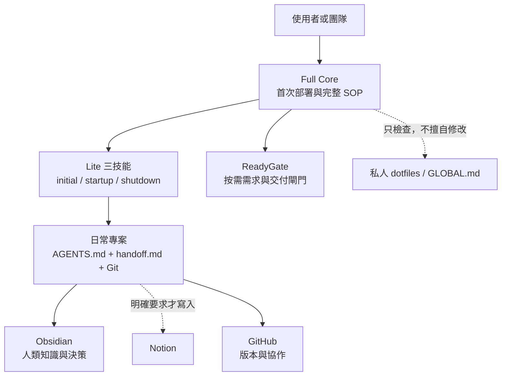

# Cross-File AI Workflow Core

> 版本：`0.1.0`
> 定位：個人優先、團隊可重用的中立 AI 工作流；Windows 優先。

這個 repository 是 **Full Core**：第一次在裝置上部署時，用它檢查全域狀態、選擇工作模式，並按需連接 Lite 三技能、ReadyGate、研究、PR、Secret 防護與外部工具流程。

日常專案預設使用 **Lite Project**。Lite 只讀 `AGENTS.md`、`handoff.md` 與 Git 狀態，不會每次重讀完整 SOP。

## 先選模式

| 情境 | 建議模式 | 日常讀取 |
|---|---|---|
| 新裝置、第一次建立完整治理 | Full Core | 首次讀 `BOOTSTRAP.md`，之後按需 |
| 一般專案、跨裝置接續 | Lite Project | `AGENTS.md`、`handoff.md`、Git |
| 已有 Lite，要做發布、遷移或高風險操作 | Lite + 按需能力 | 只載入對應 SOP／Skill |
| 公開發布、刪除、批次改動或明確要求 | ReadyGate | 需求閘門與交付閘門 |

Lite 三技能由外部 `cross-device-agent-skills` 維護；本 repo 不複製第二份 canonical Skill。相容基準記錄在 `FEATURES.json`。

## 最簡安裝：把 GitHub 連結交給 AI

把這個 repository 的連結交給 AI，並說：

```text
請先讀這個 repository 的 BOOTSTRAP.md，檢查目前全域與專案狀態。
先提出 Recommend／Lite／Full 建議與 dry-run，不要直接修改或登入。
缺少 Git、GitHub CLI 或 chezmoi 時逐項列出，不要自動安裝。
```

AI 必須先偵測、再建議、再等待確認。缺少 Git、GitHub CLI 或 chezmoi 時，只列出缺口與安裝選項；登入一定由使用者完成。

Repository：

```text
https://github.com/sink6985757-web/cross-device-agent-workflow-core
```

若工具已備妥，也可以先在 PowerShell 執行只讀 doctor：

```powershell
git clone https://github.com/sink6985757-web/cross-device-agent-workflow-core.git
Set-Location .\cross-device-agent-workflow-core
powershell -NoProfile -File .\scripts\install.ps1
```

這個命令只會輸出分類與建議，不會安裝、登入、覆寫檔案或修改 dotfiles。

## 入口

- [BOOTSTRAP.md](BOOTSTRAP.md)：AI 首次部署契約。
- [WORKFLOW.md](WORKFLOW.md)：十項可執行 SOP 與 ReadyGate 整合。
- [MAINTAINERS.md](MAINTAINERS.md)：版本、驗證、發布與 Lite vNext 銜接。
- [FEATURES.json](FEATURES.json)：功能狀態與外部相容基準。

## 雙層架構



## 權威分工

| 內容 | 權威 |
|---|---|
| Full SOP、部署契約、十項能力 | 本 repo |
| Lite 三技能 | [cross-device-agent-skills `v1.1.1`](https://github.com/sink6985757-web/cross-device-agent-skills/releases/tag/v1.1.1) |
| ReadyGate 方法與完整 Skill | 使用者指定的 ReadyGate `v0.2.1` 來源／`~/.agents/skills/readygate` |
| 個人全域規則與 Agent adapters | 私人 dotfiles |
| 專案程式與專案規則 | 各專案 Git repository |
| 長期知識與決策 | Obsidian |
| Notion | 只有明確要求時才寫入 |

## 目前限制

- `scripts/install.ps1` 只實作偵測與建議；`-Apply` 尚未開放。
- `v0.1.0` 是正式發布基準，但 Apply 仍明確標為 `PLANNED`。
- 真正安裝、登入、commit、push、批次遷移與外部寫入必須另行確認。
- ReadyGate 是可選外部依賴；公開核心不內嵌私人 Skill 或 dotfiles。
- Canonical 文件不得保存裝置絕對路徑、credential 或私人 vault 位置。

## 最短日常流程

```text
初始化專案 → initial
開始工作   → startup
結束工作   → shutdown
高風險任務 → ReadyGate
```

其他功能只有在工作真的需要時才從 `WORKFLOW.md` 載入。
